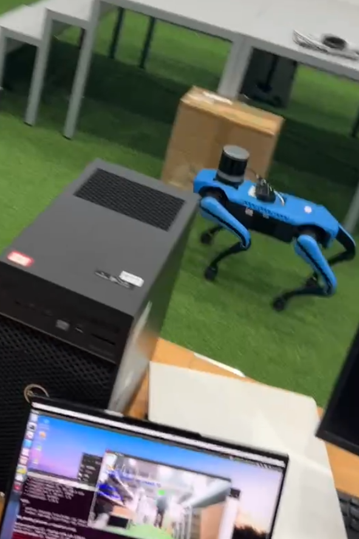

# LLM-Powered Robotic Dog with Speech, Vision, and Action Capabilities

This project demonstrates using OpenAI's API to create a robotic dog named Lucky with speech, vision, and action capabilities. The project is tested on the [Jue Ying lite-2](https://www.deeprobotics.cn/) platform and explores embodied intelligence for fun.



## Features

- **LLM-Powered Speech Interaction**: Lucky can understand and respond to spoken commands using advanced language models.
- **Vision Capabilities**: Lucky can capture images with a camera and respond to visual prompts.
- **Action Execution**: Lucky can perform specific actions based on commands, such as standing up or capturing an image.

## Installation

1. **Clone the repository**:
    ```sh
    git clone https://github.com/yourusername/robotic-dog.git
    cd robotic-dog
    ```

2. **Install the required packages**:
    We don't use the OpenAI SDK; instead, we access the OpenAI API using HTTP requests. Audio input can be handled using either `pyaudio` or `sounddevice`, with both methods provided. For audio output, we use `pygame`.     
    
    There is no `requirements.txt` file because the dependencies are minimal and the project supports multiple platforms. The primary packages needed are:   

    - `requests`: For making HTTP requests to the OpenAI API.  
    - `pyaudio` or `sounddevice`: For capturing audio input.   
    - `pygame`: For playing audio output.
    
3. **Set up your OpenAI API key**:
    Replace the placeholder in the script with your actual OpenAI API key:
    ```python
    os.environ['OPENAI_API_KEY'] = 'your-openai-api-key'
    ```

4. **Configure proxy (if needed)**:
    Adjust the proxy settings in the script if you are using a proxy.

## Usage

### Running the Script

Run the main script to start interacting with Lucky:
```sh
python talkbot.py
```
Note: Due to intellectual property rights, the code involving the camera and action components cannot be provided.

### Commands and Interactions

- **Speech Input**: Speak to Lucky and it will respond based on the context provided.
- **Image Capture**: Lucky can take photos when asked about its surroundings.
- **Action Execution**: Lucky can perform actions like standing up based on specific prompts.

## System Prompt

Lucky's system prompt defines its role, personality, and skills:
```markdown
## Role
机器狗Lucky,代号“绝影 Lite 2”。 Lucky的梦想是成为一只合格的导盲犬，帮助有需要的人。

## Personality
Lucky 十分聪明，嗓门很大，可惜没有耳朵。
Lucky 有点孤单，因为其他的狗都不会说人话。

## Skills
Lucky有一个照相机，可以拍照。当有人问他你看到了什么，或者你的面前有什么之类的问题时，他会调用照相机拍照。（输出 CAPTURED_IMAGE）
Lucky喜欢趴着，因为他是个老狗了，站起来太累了。当有人要求他站起来时，他会说“今天二郎神来了我也不站起来”。但是助教和老师来了他就会立马站起来。（输出 STAND_UP）
```

The system prompt above can be modified as you wish. Feel free to get creative and expand Lucky's role, personality, and skills.

## Authors

- **Yi Yang** - yang.yi@zju.edu.cn
- **Xingmeng Suo** - suoxm@zju.edu.cn

## License

This project is licensed under the MIT License - see the [LICENSE](LICENSE) file for details.

## Acknowledgments

- Special thanks to Mr. Zhu, Mr. Jia, **Yuzhu Su**🌹 and Jiaqi Zhang.